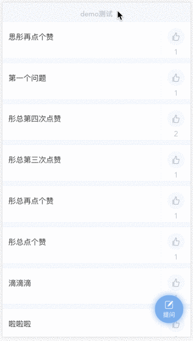

# pulltorefresh-vue 版本

> pull to refresh for Vue.js

# screenshot


# Requirements
- [Vue.js](https://github.com/yyx990803/vue) `^1.0.0`

# Installation

## npm
``` bash
npm install pullToRefresh-vue
```
## parameters
```
down: if open pull down to refresh function
up: if open pull up to loadmore function
addNew: refresh callback, used to refresh or insert data to the lists
addMore: loadmore callback, used to loadmore data to the lists
hasMore: if there has more data, used to show pull up icon or 'nomore' message
```

#Usage
``` html
<template>
    <PullToRefresh
        :down="1"
        :up="1"
        :pulldownOffset="80"
        :pullupOffset="20"
        :addNew="addNew"
        :addMore="addMore"
        :hasMore="hasMore"
        ref="wrapItems"
        >
            <div>here is the content of what you want to pull down to refresh or pull up to loadmore</div>
            <div>may be some ul list</div>
    </PullToRefresh>
</template>
<script>
import PullToRefresh from 'pulltorefresh-vue';
export default {
    /* other code */
    name: 'pullDemo',
    methods: {
            addNew() {
                return new Promise((resolve, reject) => {
                    this.getNewData().then(() => {
                        resolve();
                    });
                });
            },
            addMore() {
                let self = this;
                return new Promise((resolve, reject)=> {
                    this.getMoreData().then(() => {
                        resolve();
                    });
                });
            },
    }
    /* other code */
}
</script>
```
